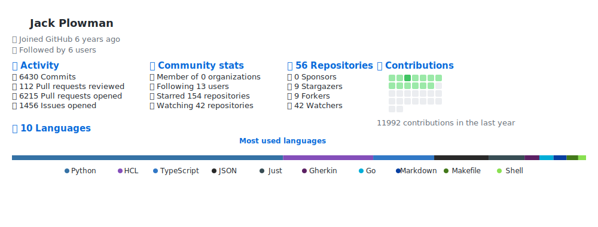

# Test Coding Metrics

Test [JackPlowman/coding-metrics](https://github.com/JackPlowman/coding-metrics) GitHub Action. This repository runs the coding metrics action main branch unless a specific version is being tested.

## Table of Contents

- [Test Coding Metrics](#test-coding-metrics)
  - [Table of Contents](#table-of-contents)
  - [JackPlowman/coding-metrics Output](#jackplowmancoding-metrics-output)
    - [Aternative Colours](#aternative-colours)
      - [Dark Theme](#dark-theme)
      - [Ocean Theme](#ocean-theme)
      - [Sunset Theme](#sunset-theme)
  - [Contributing](#contributing)

## JackPlowman/coding-metrics Output

### Aternative Colours

#### Dark Theme

#### Ocean Theme

#### Sunset Theme

## Contributing

We welcome contributions to the project. Please read the [Contributing Guidelines](docs/CONTRIBUTING.md) for more information.
