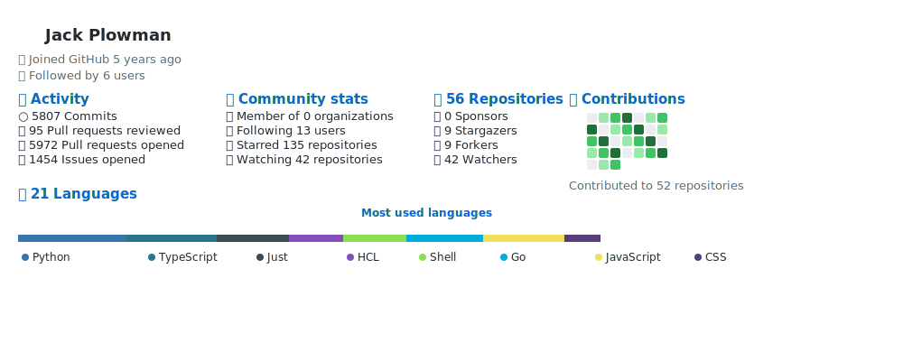

# Test Coding Metrics

Test [JackPlowman/coding-metrics](https://github.com/JackPlowman/coding-metrics) GitHub Action. This repository runs the coding metrics action main branch unless a specific version is being tested.

## Table of Contents

- [Test Coding Metrics](#test-coding-metrics)
  - [Table of Contents](#table-of-contents)
  - [JackPlowman/coding-metrics Output](#jackplowmancoding-metrics-output)
  - [Contributing](#contributing)

## JackPlowman/coding-metrics Output

The current version of the coding-metrics action produces an SVG file named `output.svg` in the root of the repository. Below is the latest output generated by the action:

## Contributing

We welcome contributions to the project. Please read the [Contributing Guidelines](docs/CONTRIBUTING.md) for more information.
